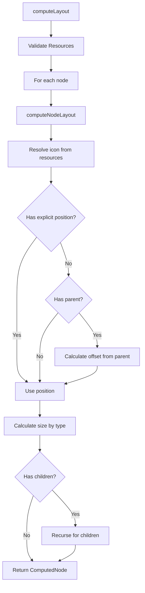
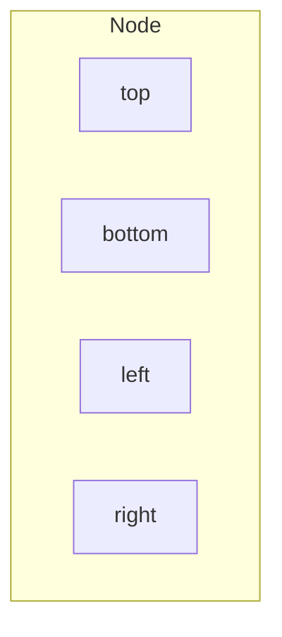

# Layout Specification

This document describes the layout calculation system for gospelo diagrams.

## Overview

The layout engine (`src/layout/layout.ts`) computes positions and sizes for nodes, handling resource icon resolution and validation.

## Layout Constants

| Constant               | Value | Description                   |
| ---------------------- | ----- | ----------------------------- |
| `DEFAULT_ICON_SIZE`    | 48    | Default icon width/height     |
| `DEFAULT_GROUP_PADDING`| 20    | Padding inside group nodes    |
| `DEFAULT_SPACING`      | 30    | Spacing between child nodes   |
| `DEFAULT_LABEL_HEIGHT` | 80    | Height reserved for labels    |

## Computation Flow



## Resource Resolution

Icons are resolved in this order:

1. Node's explicit `icon` property (highest priority)
2. Resource's `icon` property (if node ID matches)
3. `undefined` (no icon)

```typescript
let resolvedIcon = node.icon;
if (!resolvedIcon && resources[node.id]) {
  resolvedIcon = resources[node.id].icon;
}
```

### Resource Validation

Each resource ID can only be used by one node:

```typescript
if (usedResourceIds.has(node.id)) {
  throw new Error(`Resource "${node.id}" is used by multiple nodes.`);
}
```

## Size Calculation by Node Type

### Icon Nodes (default)

```
width  = node.size[0] || 48
height = node.size[1] || 48 + 80 (label height)
```

### Group Nodes

**Horizontal Layout:**
```
width  = padding*2 + childCount * (iconSize + spacing)
height = iconSize + labelHeight + padding*2 + 30
```

**Vertical Layout:**
```
width  = iconSize + padding*2 + 20
height = padding*2 + 30 + childCount * (iconSize + labelHeight + spacing)
```

### Composite Nodes

**Horizontal Layout:**
```
width  = padding*2 + iconCount * (iconSize + spacing)
height = iconSize + padding*2 + labelHeight
```
Where: `padding = 20`, `spacing = 10`, `iconSize = 40`

**Vertical Layout:**
```
width  = iconSize + padding*2
height = padding*2 + iconCount * (iconSize + spacing) + labelHeight
```

### Text Box Nodes

```
width  = max(60, labelLength * 8 + 20)
height = sublabel ? 50 : 30
```

## Child Offset Calculation

Children are positioned relative to their parent group:

**Horizontal Layout:**
```typescript
{
  x: padding + index * (iconSize + spacing),
  y: padding + 20  // Account for group label
}
```

**Vertical Layout:**
```typescript
{
  x: padding,
  y: padding + 20 + index * (iconSize + labelHeight + spacing)
}
```

## Computed Node Structure

```typescript
interface ComputedNode extends Node {
  computedX: number;      // Absolute X position
  computedY: number;      // Absolute Y position
  computedWidth: number;  // Computed width
  computedHeight: number; // Computed height
  icon?: string;          // Resolved icon
  children?: ComputedNode[];
}
```

## Anchor Points

For connection routing, nodes provide anchor points:



### getNodeCenter

```typescript
function getNodeCenter(node: ComputedNode): { x: number; y: number } {
  return {
    x: node.computedX + node.computedWidth / 2,
    y: node.computedY + node.computedHeight / 2,
  };
}
```

### getNodeAnchors

```typescript
function getNodeAnchors(node: ComputedNode): {
  top: { x: number; y: number };
  bottom: { x: number; y: number };
  left: { x: number; y: number };
  right: { x: number; y: number };
}
```

| Anchor   | X                                  | Y                                    |
| -------- | ---------------------------------- | ------------------------------------ |
| `top`    | `computedX + computedWidth / 2`    | `computedY`                          |
| `bottom` | `computedX + computedWidth / 2`    | `computedY + computedHeight`         |
| `left`   | `computedX`                        | `computedY + computedHeight / 2`     |
| `right`  | `computedX + computedWidth`        | `computedY + computedHeight / 2`     |

## Usage Example

```typescript
import { computeLayout, getNodeCenter, getNodeAnchors } from 'gospelo-architect';

const diagram = {
  title: 'Test',
  resources: {
    '@api': { icon: 'aws:api_gateway' }
  },
  nodes: [
    { id: '@api', position: [100, 100] }
  ]
};

const computed = computeLayout(diagram);

// Get center point
const center = getNodeCenter(computed[0]);
console.log(center); // { x: 124, y: 164 }

// Get anchor points
const anchors = getNodeAnchors(computed[0]);
console.log(anchors.right); // { x: 148, y: 164 }
```

## Error Handling

| Error Condition                  | Error Message                                                           |
| -------------------------------- | ----------------------------------------------------------------------- |
| Resource used by multiple nodes  | `Resource "{id}" is used by multiple nodes. Each resource ID must be unique.` |
