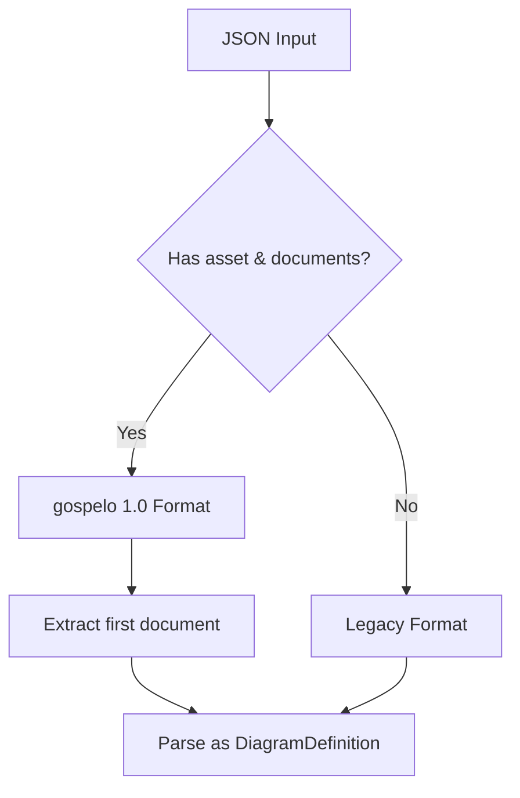

# Parser Specification

This document describes the JSON parser for gospelo documents.

## Overview

The parser (`src/core/parser.ts`) converts JSON input into a validated `DiagramDefinition` object. It supports both gospelo 1.0 format and legacy diagram format.

## Format Detection



### gospelo 1.0 Format

```json
{
  "asset": { "version": "1.0" },
  "documents": [
    {
      "type": "diagram",
      "title": "My Diagram",
      "nodes": [...],
      "connections": [...]
    }
  ]
}
```

### Legacy Format

```json
{
  "title": "My Diagram",
  "nodes": [...],
  "connections": [...]
}
```

## Property Naming Convention

The parser accepts both **camelCase** and **snake_case** property names:

| camelCase       | snake_case       |
| --------------- | ---------------- |
| `borderColor`   | `border_color`   |
| `startColor`    | `start_color`    |
| `endColor`      | `end_color`      |
| `labelPosition` | `label_position` |
| `parentId`      | `parent_id`      |
| `fromSide`      | `from_side`      |
| `toSide`        | `to_side`        |
| `groupIcon`     | `group_icon`     |

## Parsing Flow

```mermaid
flowchart LR
    A[parseDiagram] --> B[isGospeloFormat?]
    B -->|Yes| C[Extract documents[0]]
    B -->|No| D[parseLegacyDiagram]
    C --> D
    D --> E[parseBackground]
    D --> F[parseNodes]
    D --> G[parseConnections]
```

## Node Parsing

### Node Properties

| Property        | Type               | Default           |
| --------------- | ------------------ | ----------------- |
| `id`            | string             | (required)        |
| `type`          | NodeType           | `"icon"`          |
| `icon`          | string             | -                 |
| `label`         | string             | `""`              |
| `sublabel`      | string             | `""`              |
| `position`      | [number, number]   | -                 |
| `size`          | [number, number]   | -                 |
| `borderColor`   | string             | -                 |
| `layout`        | LayoutDirection    | `"horizontal"`    |
| `labelPosition` | LabelPosition      | `"inside-top-left"` |
| `groupIcon`     | string             | -                 |
| `parentId`      | string             | -                 |
| `children`      | Node[]             | -                 |
| `icons`         | IconRef[]          | -                 |

### Parent ID Validation

Child nodes within groups must have `parentId` set to the parent group's `id`:

```json
{
  "id": "vpc",
  "type": "group",
  "children": [
    { "id": "subnet", "icon": "aws:subnet", "parentId": "vpc" }
  ]
}
```

**Validation Rules:**

1. Child nodes MUST have `parentId` field
2. `parentId` MUST match the parent group's `id`
3. Top-level nodes MUST NOT have `parentId`

**Error Messages:**

- `Child node "{id}" must have parent_id field set to "{parentId}"`
- `Child node "{id}" has incorrect parent_id: expected "{expected}", got "{actual}"`
- `Top-level node "{id}" should not have parent_id field`

## Connection Parsing

### Connection Properties

| Property        | Type            | Default        |
| --------------- | --------------- | -------------- |
| `from`          | string          | (required)     |
| `to`            | string          | (required)     |
| `type`          | ConnectionType  | `"data"`       |
| `width`         | number          | `2`            |
| `color`         | string          | -              |
| `style`         | ConnectionStyle | `"orthogonal"` |
| `bidirectional` | boolean         | `false`        |
| `label`         | string          | `""`           |
| `fromSide`      | AnchorSide      | -              |
| `toSide`        | AnchorSide      | -              |

## Background Parsing

### Background Types

| Type       | Properties                              |
| ---------- | --------------------------------------- |
| `white`    | (none)                                  |
| `solid`    | `color`                                 |
| `gradient` | `startColor`, `endColor`, `direction`   |

**Default:** `{ type: "white" }`

## Validation

The `validateDiagram` function checks:

1. **Duplicate Node IDs**: Each node ID must be unique
2. **Connection References**: Connections must reference existing nodes

```typescript
const errors = validateDiagram(diagram);
if (errors.length > 0) {
  console.error('Validation errors:', errors);
}
```

**Error Messages:**

- `Duplicate node ID: {id}`
- `Connection references unknown node: {nodeId}`

## Default Colors

The parser merges custom colors with default colors:

| Name     | Value     |
| -------- | --------- |
| `blue`   | `#0073BB` |
| `orange` | `#FF9900` |
| `dark`   | `#232F3E` |
| `gray`   | `#666666` |

## Usage Example

```typescript
import { parseDiagram, validateDiagram } from 'gospelo-architect';

// Parse JSON string
const diagram = parseDiagram(`{
  "title": "My Diagram",
  "nodes": [
    { "id": "@api", "icon": "aws:api_gateway", "position": [100, 100] }
  ]
}`);

// Validate
const errors = validateDiagram(diagram);
if (errors.length === 0) {
  console.log('Diagram is valid');
}
```

## Error Handling

| Error Condition                     | Error Message                                                  |
| ----------------------------------- | -------------------------------------------------------------- |
| gospelo format with no documents    | `gospelo document must have at least one document in documents array` |
| Unsupported document type           | `Unsupported document type: {type}. Only 'diagram' is currently supported.` |
| Missing title                       | `Diagram must have a title`                                    |
| Invalid parent ID (missing)         | `Child node "{id}" must have parent_id field set to "{parentId}"` |
| Invalid parent ID (mismatch)        | `Child node "{id}" has incorrect parent_id: expected "{expected}", got "{actual}"` |
| Top-level node with parent ID       | `Top-level node "{id}" should not have parent_id field`        |
