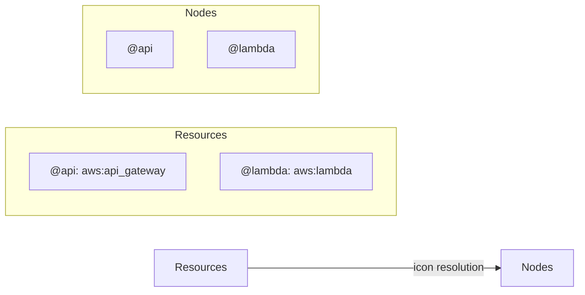

# Resources Specification

This document describes the Resources feature for gospelo diagrams.

## Overview

Resources provide a mechanism for defining reusable icon and metadata definitions that can be referenced by node IDs. This promotes consistency and reduces duplication in diagram definitions.

## Concept



## Resource Definition

### Structure

```typescript
interface Resource {
  icon: string;   // Icon identifier (required)
  desc?: string;  // Description (optional)
}

interface ResourceMap {
  [nodeId: string]: Resource;
}
```

### Example

```json
{
  "resources": {
    "@api": {
      "icon": "aws:api_gateway",
      "desc": "REST API endpoint"
    },
    "@lambda": {
      "icon": "aws:lambda",
      "desc": "Business logic handler"
    },
    "@db": {
      "icon": "aws:dynamodb",
      "desc": "Data storage"
    }
  }
}
```

## ID Convention

Resource IDs SHOULD start with `@` prefix for clarity:

```json
{
  "resources": {
    "@api": { "icon": "aws:api_gateway" },
    "@db": { "icon": "aws:dynamodb" }
  },
  "nodes": [
    { "id": "@api", "label": "API Gateway" },
    { "id": "@db", "label": "Database" }
  ]
}
```

**Benefits of `@` prefix:**
- Clearly distinguishes resource-backed nodes
- Prevents ID collisions with other identifiers
- Improves readability in large diagrams

## Icon Resolution Priority

When rendering a node, icons are resolved in this order:

```mermaid
flowchart TD
    A[Node] --> B{Has explicit icon?}
    B -->|Yes| C[Use node.icon]
    B -->|No| D{ID in resources?}
    D -->|Yes| E[Use resources[id].icon]
    D -->|No| F[No icon]
```

### Priority Order

1. **Node's explicit `icon` property** (highest priority)
2. **Resource's `icon` property** (if node ID matches a resource key)
3. **undefined** (no icon)

### Override Example

```json
{
  "resources": {
    "@api": { "icon": "aws:api_gateway" }
  },
  "nodes": [
    { "id": "@api", "icon": "aws:lambda" }
  ]
}
```

**Result:** Node uses `aws:lambda` (explicit) instead of `aws:api_gateway` (resource).

## Validation Rules

### Rule 1: Unique Resource Usage

Each resource ID must be used by at most one node:

```json
{
  "resources": {
    "@api": { "icon": "aws:api_gateway" }
  },
  "nodes": [
    { "id": "@api", "label": "Gateway 1" },
    { "id": "@api", "label": "Gateway 2" }
  ]
}
```

**Error:** `Resource "@api" is used by multiple nodes. Each resource ID must be unique.`

### Rule 2: Icon Requirement

Nodes without matching resources must have an explicit `icon` property:

```json
{
  "resources": {
    "@api": { "icon": "aws:api_gateway" }
  },
  "nodes": [
    { "id": "@api" },
    { "id": "@other", "icon": "aws:s3" }
  ]
}
```

`@api` gets icon from resources, `@other` needs explicit icon.

## Implementation

### Layout Resolution

```typescript
// src/layout/layout.ts
function computeNodeLayout(node: Node, index: number, parent: ComputedNode | null, resources: ResourceMap): ComputedNode {
  // Resolve icon from resources if not specified
  let resolvedIcon = node.icon;
  if (!resolvedIcon && resources[node.id]) {
    resolvedIcon = resources[node.id].icon;
  }

  const computed: ComputedNode = {
    ...node,
    icon: resolvedIcon,
    // ...
  };
  // ...
}
```

### Parser Support

```typescript
// src/core/parser.ts
function parseLegacyDiagram(raw: RawDiagramInput): DiagramDefinition {
  const diagram: DiagramDefinition = {
    title: raw.title,
    // ...
    resources: (raw as any).resources,
    // ...
  };
  return diagram;
}
```

## Use Cases

### 1. Centralized Icon Management

Define icons once, use everywhere:

```json
{
  "resources": {
    "@api": { "icon": "aws:api_gateway", "desc": "API endpoint" },
    "@lambda": { "icon": "aws:lambda", "desc": "Compute" },
    "@db": { "icon": "aws:dynamodb", "desc": "Storage" }
  },
  "nodes": [
    { "id": "@api", "label": "REST API", "position": [100, 100] },
    { "id": "@lambda", "label": "Handler", "position": [300, 100] },
    { "id": "@db", "label": "Users Table", "position": [500, 100] }
  ]
}
```

### 2. Documentation Integration

Use `desc` for documentation:

```json
{
  "resources": {
    "@auth": {
      "icon": "aws:cognito",
      "desc": "Handles user authentication and authorization. Integrates with corporate LDAP."
    }
  }
}
```

### 3. Template Patterns

Create reusable patterns:

```json
{
  "resources": {
    "@frontend": { "icon": "aws:cloudfront", "desc": "CDN" },
    "@api": { "icon": "aws:api_gateway", "desc": "REST API" },
    "@compute": { "icon": "aws:lambda", "desc": "Serverless compute" },
    "@storage": { "icon": "aws:s3", "desc": "Object storage" },
    "@database": { "icon": "aws:dynamodb", "desc": "NoSQL database" }
  }
}
```

## Complete Example

```json
{
  "asset": { "version": "1.0" },
  "documents": [
    {
      "type": "diagram",
      "title": "Serverless Architecture",
      "resources": {
        "@cdn": { "icon": "aws:cloudfront", "desc": "Content delivery" },
        "@api": { "icon": "aws:api_gateway", "desc": "REST API endpoint" },
        "@auth": { "icon": "aws:cognito", "desc": "User authentication" },
        "@lambda": { "icon": "aws:lambda", "desc": "Business logic" },
        "@db": { "icon": "aws:dynamodb", "desc": "Data storage" }
      },
      "nodes": [
        { "id": "@cdn", "label": "CloudFront", "position": [100, 200] },
        { "id": "@api", "label": "API Gateway", "position": [250, 200] },
        { "id": "@auth", "label": "Cognito", "position": [250, 350] },
        { "id": "@lambda", "label": "Lambda", "position": [400, 200] },
        { "id": "@db", "label": "DynamoDB", "position": [550, 200] }
      ],
      "connections": [
        { "from": "@cdn", "to": "@api" },
        { "from": "@api", "to": "@auth", "type": "auth" },
        { "from": "@api", "to": "@lambda" },
        { "from": "@lambda", "to": "@db", "type": "data" }
      ]
    }
  ]
}
```

## Migration Guide

### From Explicit Icons

**Before:**
```json
{
  "nodes": [
    { "id": "api", "icon": "aws:api_gateway", "label": "API" },
    { "id": "lambda", "icon": "aws:lambda", "label": "Lambda" }
  ]
}
```

**After:**
```json
{
  "resources": {
    "@api": { "icon": "aws:api_gateway" },
    "@lambda": { "icon": "aws:lambda" }
  },
  "nodes": [
    { "id": "@api", "label": "API" },
    { "id": "@lambda", "label": "Lambda" }
  ]
}
```

**Benefits:**
- Centralized icon management
- Cleaner node definitions
- Easier bulk icon updates
- Documentation via `desc` property
