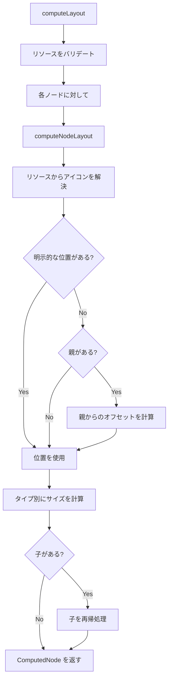
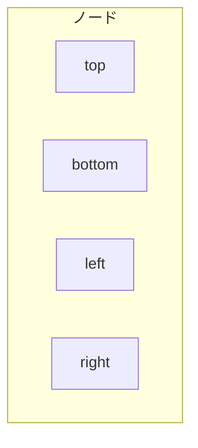

# レイアウト仕様

このドキュメントでは、gospelo ダイアグラムのレイアウト計算システムについて説明します。

## 概要

レイアウトエンジン（`src/layout/layout.ts`）は、ノードの位置とサイズを計算し、リソースアイコンの解決とバリデーションを処理します。

## レイアウト定数

| 定数                   | 値   | 説明                           |
| ---------------------- | ---- | ------------------------------ |
| `DEFAULT_ICON_SIZE`    | 48   | デフォルトのアイコン幅/高さ    |
| `DEFAULT_GROUP_PADDING`| 20   | グループノード内のパディング   |
| `DEFAULT_SPACING`      | 30   | 子ノード間のスペーシング       |
| `DEFAULT_LABEL_HEIGHT` | 80   | ラベル用に確保する高さ         |

## 計算フロー



## リソース解決

アイコンは以下の順序で解決されます：

1. ノードの明示的な `icon` プロパティ（最優先）
2. リソースの `icon` プロパティ（ノード ID が一致する場合）
3. `undefined`（アイコンなし）

```typescript
let resolvedIcon = node.icon;
if (!resolvedIcon && resources[node.id]) {
  resolvedIcon = resources[node.id].icon;
}
```

### リソースバリデーション

各リソース ID は 1 つのノードでのみ使用できます：

```typescript
if (usedResourceIds.has(node.id)) {
  throw new Error(`Resource "${node.id}" is used by multiple nodes.`);
}
```

## ノードタイプ別サイズ計算

### Icon ノード（デフォルト）

```
width  = node.size[0] || 48
height = node.size[1] || 48 + 80 (ラベル高さ)
```

### Group ノード

**水平レイアウト：**
```
width  = padding*2 + childCount * (iconSize + spacing)
height = iconSize + labelHeight + padding*2 + 30
```

**垂直レイアウト：**
```
width  = iconSize + padding*2 + 20
height = padding*2 + 30 + childCount * (iconSize + labelHeight + spacing)
```

### Composite ノード

**水平レイアウト：**
```
width  = padding*2 + iconCount * (iconSize + spacing)
height = iconSize + padding*2 + labelHeight
```
ここで: `padding = 20`, `spacing = 10`, `iconSize = 40`

**垂直レイアウト：**
```
width  = iconSize + padding*2
height = padding*2 + iconCount * (iconSize + spacing) + labelHeight
```

### Text Box ノード

```
width  = max(60, labelLength * 8 + 20)
height = sublabel ? 50 : 30
```

## 子オフセット計算

子は親グループからの相対位置で配置されます：

**水平レイアウト：**
```typescript
{
  x: padding + index * (iconSize + spacing),
  y: padding + 20  // グループラベルを考慮
}
```

**垂直レイアウト：**
```typescript
{
  x: padding,
  y: padding + 20 + index * (iconSize + labelHeight + spacing)
}
```

## ComputedNode 構造

```typescript
interface ComputedNode extends Node {
  computedX: number;      // 絶対 X 座標
  computedY: number;      // 絶対 Y 座標
  computedWidth: number;  // 計算された幅
  computedHeight: number; // 計算された高さ
  icon?: string;          // 解決されたアイコン
  children?: ComputedNode[];
}
```

## アンカーポイント

接続ルーティング用に、ノードはアンカーポイントを提供します：



### getNodeCenter

```typescript
function getNodeCenter(node: ComputedNode): { x: number; y: number } {
  return {
    x: node.computedX + node.computedWidth / 2,
    y: node.computedY + node.computedHeight / 2,
  };
}
```

### getNodeAnchors

```typescript
function getNodeAnchors(node: ComputedNode): {
  top: { x: number; y: number };
  bottom: { x: number; y: number };
  left: { x: number; y: number };
  right: { x: number; y: number };
}
```

| アンカー | X                                  | Y                                    |
| -------- | ---------------------------------- | ------------------------------------ |
| `top`    | `computedX + computedWidth / 2`    | `computedY`                          |
| `bottom` | `computedX + computedWidth / 2`    | `computedY + computedHeight`         |
| `left`   | `computedX`                        | `computedY + computedHeight / 2`     |
| `right`  | `computedX + computedWidth`        | `computedY + computedHeight / 2`     |

## 使用例

```typescript
import { computeLayout, getNodeCenter, getNodeAnchors } from 'gospelo-architect';

const diagram = {
  title: 'Test',
  resources: {
    '@api': { icon: 'aws:api_gateway' }
  },
  nodes: [
    { id: '@api', position: [100, 100] }
  ]
};

const computed = computeLayout(diagram);

// 中心点を取得
const center = getNodeCenter(computed[0]);
console.log(center); // { x: 124, y: 164 }

// アンカーポイントを取得
const anchors = getNodeAnchors(computed[0]);
console.log(anchors.right); // { x: 148, y: 164 }
```

## エラーハンドリング

| エラー条件                       | エラーメッセージ                                                            |
| -------------------------------- | --------------------------------------------------------------------------- |
| リソースが複数ノードで使用される | `Resource "{id}" is used by multiple nodes. Each resource ID must be unique.` |

## 接続ルーティング仕様

### 出口・入口方向ルール

接続線は直交パス（水平・垂直のセグメントのみ）で描画されます。

#### 出口方向ルール

出口辺に対して直角かつ外向きに最初のセグメントが向かう：

| 出口辺 | 出口方向 | 条件 |
|--------|----------|------|
| top | ↑ | y2 < y1 |
| bottom | ↓ | y2 > y1 |
| left | ← | x2 < x1 |
| right | → | x2 > x1 |

#### 入口方向ルール

入口辺に対して直角かつ内向きに最後のセグメントが向かう：

| 入口辺 | 入口方向 | 条件 |
|--------|----------|------|
| top | ↓ | y2 > y1 |
| bottom | ↑ | y2 < y1 |
| left | → | x2 > x1 |
| right | ← | x2 < x1 |

### パターン分類

#### U字パターン（出口辺 = 入口辺）

同じ辺から出入りするため、回り込みが必要なパターン：

| 出口辺 | 入口辺 | 出口方向 | 入口方向 | 形状 |
|--------|--------|----------|----------|------|
| top | top | ↑ | ↓ | ∩ |
| bottom | bottom | ↓ | ↑ | ∪ |
| left | left | ← | → | ⊂ |
| right | right | → | ← | ⊃ |

#### 非U字パターン（出口辺 ≠ 入口辺）

異なる辺から出入りするパターン（I字、L字、Z字）：

| 出口辺 | 入口辺 | 出口方向 | 入口方向 |
|--------|--------|----------|----------|
| top | bottom | ↑ | ↑ |
| top | left | ↑ | → |
| top | right | ↑ | ← |
| bottom | top | ↓ | ↓ |
| bottom | left | ↓ | → |
| bottom | right | ↓ | ← |
| left | top | ← | ↓ |
| left | bottom | ← | ↑ |
| left | right | ← | ← |
| right | top | → | ↓ |
| right | bottom | → | ↑ |
| right | left | → | → |

### レイアウト別優先度

#### Portrait レイアウト優先度（上→下、左→右）

出口方向優先度: ↓ > → > ← > ↑

| 優先度 | 出口辺 | 入口辺 | 出口方向 | 入口方向 | タイプ |
|--------|--------|--------|----------|----------|--------|
| 1 | bottom | top | ↓ | ↓ | 非U字 |
| 2 | bottom | left | ↓ | → | 非U字 |
| 3 | bottom | right | ↓ | ← | 非U字 |
| 4 | bottom | bottom | ↓ | ↑ | U字 |
| 5 | right | top | → | ↓ | 非U字 |
| 6 | right | left | → | → | 非U字 |
| 7 | right | bottom | → | ↑ | 非U字 |
| 8 | right | right | → | ← | U字 |
| 9 | left | top | ← | ↓ | 非U字 |
| 10 | left | right | ← | ← | 非U字 |
| 11 | left | bottom | ← | ↑ | 非U字 |
| 12 | left | left | ← | → | U字 |
| 13 | top | bottom | ↑ | ↑ | 非U字 |
| 14 | top | left | ↑ | → | 非U字 |
| 15 | top | right | ↑ | ← | 非U字 |
| 16 | top | top | ↑ | ↓ | U字 |

#### Landscape レイアウト優先度（左→右、上→下）

出口方向優先度: → > ↓ > ↑ > ←

| 優先度 | 出口辺 | 入口辺 | 出口方向 | 入口方向 | タイプ |
|--------|--------|--------|----------|----------|--------|
| 1 | right | left | → | → | 非U字 |
| 2 | right | top | → | ↓ | 非U字 |
| 3 | right | bottom | → | ↑ | 非U字 |
| 4 | right | right | → | ← | U字 |
| 5 | bottom | top | ↓ | ↓ | 非U字 |
| 6 | bottom | left | ↓ | → | 非U字 |
| 7 | bottom | right | ↓ | ← | 非U字 |
| 8 | bottom | bottom | ↓ | ↑ | U字 |
| 9 | top | bottom | ↑ | ↑ | 非U字 |
| 10 | top | left | ↑ | → | 非U字 |
| 11 | top | right | ↑ | ← | 非U字 |
| 12 | top | top | ↑ | ↓ | U字 |
| 13 | left | right | ← | ← | 非U字 |
| 14 | left | top | ← | ↓ | 非U字 |
| 15 | left | bottom | ← | ↑ | 非U字 |
| 16 | left | left | ← | → | U字 |

### 接続処理順序（戦略別）

接続を処理する順序は、線の重なりや迂回に影響します。

#### 利用可能な戦略（ConnectionSortStrategy）

| 戦略 | ソート基準 | 説明 |
|------|-----------|------|
| `original` | なし | 定義順のまま |
| `vertical_length_desc` | 垂直距離（長い順） | 長い接続を先に処理 |
| `vertical_length_asc` | 垂直距離（短い順） | 短い接続を先に処理 |
| `target_y_asc` | ターゲットY座標（上から） | 上のノードへの接続を先に |
| `target_y_desc` | ターゲットY座標（下から） | 下のノードへの接続を先に |
| `source_x_asc` | ソースX座標（左から） | 左のノードからの接続を先に |
| `source_x_desc` | ソースX座標（右から） | 右のノードからの接続を先に |
| `bounding_box_aware` | バウンディングボックス形状 | 水平/垂直の支配方向で判断 |

#### レイアウト別推奨戦略

##### Portrait レイアウト

| 推奨戦略 | 理由 |
|----------|------|
| `target_y_asc` | 上のターゲットへの接続を優先（メインフロー方向） |
| `vertical_length_desc` | 長い接続を先に処理し、短い接続に迂回の余地を残す |

##### Landscape レイアウト

| 推奨戦略 | 理由 |
|----------|------|
| `source_x_asc` | 左のノードから順に処理（メインフロー方向） |
| `bounding_box_aware` | 水平方向の接続を優先 |