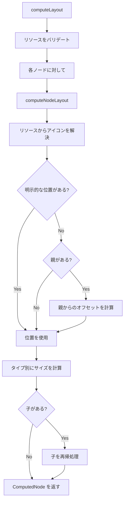
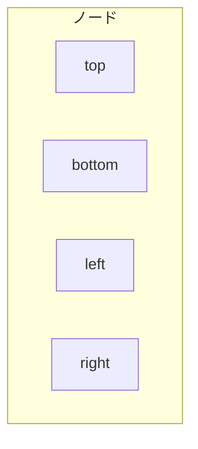

# レイアウト仕様

このドキュメントでは、gospelo ダイアグラムのレイアウト計算システムについて説明します。

## 概要

レイアウトエンジン（`src/layout/layout.ts`）は、ノードの位置とサイズを計算し、リソースアイコンの解決とバリデーションを処理します。

## レイアウト定数

| 定数                   | 値   | 説明                           |
| ---------------------- | ---- | ------------------------------ |
| `DEFAULT_ICON_SIZE`    | 48   | デフォルトのアイコン幅/高さ    |
| `DEFAULT_GROUP_PADDING`| 20   | グループノード内のパディング   |
| `DEFAULT_SPACING`      | 30   | 子ノード間のスペーシング       |
| `DEFAULT_LABEL_HEIGHT` | 80   | ラベル用に確保する高さ         |

## 計算フロー



## リソース解決

アイコンは以下の順序で解決されます：

1. ノードの明示的な `icon` プロパティ（最優先）
2. リソースの `icon` プロパティ（ノード ID が一致する場合）
3. `undefined`（アイコンなし）

```typescript
let resolvedIcon = node.icon;
if (!resolvedIcon && resources[node.id]) {
  resolvedIcon = resources[node.id].icon;
}
```

### リソースバリデーション

各リソース ID は 1 つのノードでのみ使用できます：

```typescript
if (usedResourceIds.has(node.id)) {
  throw new Error(`Resource "${node.id}" is used by multiple nodes.`);
}
```

## ノードタイプ別サイズ計算

### Icon ノード（デフォルト）

```
width  = node.size[0] || 48
height = node.size[1] || 48 + 80 (ラベル高さ)
```

### Group ノード

**水平レイアウト：**
```
width  = padding*2 + childCount * (iconSize + spacing)
height = iconSize + labelHeight + padding*2 + 30
```

**垂直レイアウト：**
```
width  = iconSize + padding*2 + 20
height = padding*2 + 30 + childCount * (iconSize + labelHeight + spacing)
```

### Composite ノード

**水平レイアウト：**
```
width  = padding*2 + iconCount * (iconSize + spacing)
height = iconSize + padding*2 + labelHeight
```
ここで: `padding = 20`, `spacing = 10`, `iconSize = 40`

**垂直レイアウト：**
```
width  = iconSize + padding*2
height = padding*2 + iconCount * (iconSize + spacing) + labelHeight
```

### Text Box ノード

```
width  = max(60, labelLength * 8 + 20)
height = sublabel ? 50 : 30
```

## 子オフセット計算

子は親グループからの相対位置で配置されます：

**水平レイアウト：**
```typescript
{
  x: padding + index * (iconSize + spacing),
  y: padding + 20  // グループラベルを考慮
}
```

**垂直レイアウト：**
```typescript
{
  x: padding,
  y: padding + 20 + index * (iconSize + labelHeight + spacing)
}
```

## ComputedNode 構造

```typescript
interface ComputedNode extends Node {
  computedX: number;      // 絶対 X 座標
  computedY: number;      // 絶対 Y 座標
  computedWidth: number;  // 計算された幅
  computedHeight: number; // 計算された高さ
  icon?: string;          // 解決されたアイコン
  children?: ComputedNode[];
}
```

## アンカーポイント

接続ルーティング用に、ノードはアンカーポイントを提供します：



### getNodeCenter

```typescript
function getNodeCenter(node: ComputedNode): { x: number; y: number } {
  return {
    x: node.computedX + node.computedWidth / 2,
    y: node.computedY + node.computedHeight / 2,
  };
}
```

### getNodeAnchors

```typescript
function getNodeAnchors(node: ComputedNode): {
  top: { x: number; y: number };
  bottom: { x: number; y: number };
  left: { x: number; y: number };
  right: { x: number; y: number };
}
```

| アンカー | X                                  | Y                                    |
| -------- | ---------------------------------- | ------------------------------------ |
| `top`    | `computedX + computedWidth / 2`    | `computedY`                          |
| `bottom` | `computedX + computedWidth / 2`    | `computedY + computedHeight`         |
| `left`   | `computedX`                        | `computedY + computedHeight / 2`     |
| `right`  | `computedX + computedWidth`        | `computedY + computedHeight / 2`     |

## 使用例

```typescript
import { computeLayout, getNodeCenter, getNodeAnchors } from 'gospelo-architect';

const diagram = {
  title: 'Test',
  resources: {
    '@api': { icon: 'aws:api_gateway' }
  },
  nodes: [
    { id: '@api', position: [100, 100] }
  ]
};

const computed = computeLayout(diagram);

// 中心点を取得
const center = getNodeCenter(computed[0]);
console.log(center); // { x: 124, y: 164 }

// アンカーポイントを取得
const anchors = getNodeAnchors(computed[0]);
console.log(anchors.right); // { x: 148, y: 164 }
```

## エラーハンドリング

| エラー条件                       | エラーメッセージ                                                            |
| -------------------------------- | --------------------------------------------------------------------------- |
| リソースが複数ノードで使用される | `Resource "{id}" is used by multiple nodes. Each resource ID must be unique.` |
