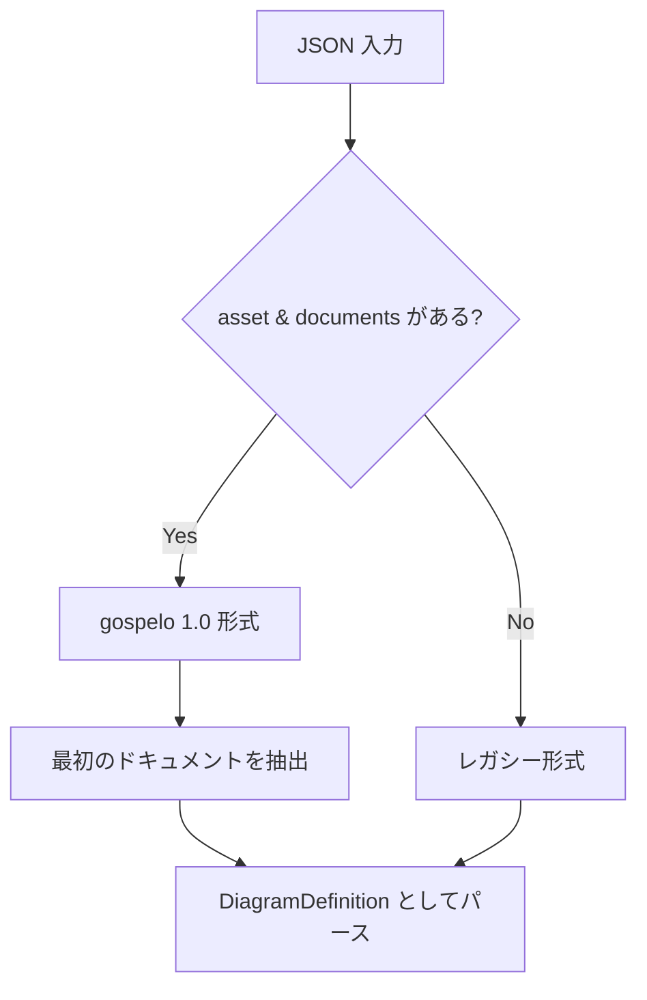

# パーサー仕様

このドキュメントでは、gospelo ドキュメント用の JSON パーサーについて説明します。

## 概要

パーサー（`src/core/parser.ts`）は JSON 入力を検証済みの `DiagramDefinition` オブジェクトに変換します。gospelo 1.0 形式とレガシーダイアグラム形式の両方をサポートしています。

## フォーマット検出



### gospelo 1.0 形式

```json
{
  "asset": { "version": "1.0" },
  "documents": [
    {
      "type": "diagram",
      "title": "My Diagram",
      "nodes": [...],
      "connections": [...]
    }
  ]
}
```

### レガシー形式

```json
{
  "title": "My Diagram",
  "nodes": [...],
  "connections": [...]
}
```

## プロパティ命名規則

パーサーは **camelCase** と **snake_case** の両方のプロパティ名を受け入れます：

| camelCase       | snake_case       |
| --------------- | ---------------- |
| `borderColor`   | `border_color`   |
| `startColor`    | `start_color`    |
| `endColor`      | `end_color`      |
| `labelPosition` | `label_position` |
| `parentId`      | `parent_id`      |
| `fromSide`      | `from_side`      |
| `toSide`        | `to_side`        |
| `groupIcon`     | `group_icon`     |

## パース処理フロー

```mermaid
flowchart LR
    A[parseDiagram] --> B[isGospeloFormat?]
    B -->|Yes| C[documents[0] を抽出]
    B -->|No| D[parseLegacyDiagram]
    C --> D
    D --> E[parseBackground]
    D --> F[parseNodes]
    D --> G[parseConnections]
```

## ノードのパース

### ノードプロパティ

| プロパティ      | 型                 | デフォルト          |
| --------------- | ------------------ | ------------------- |
| `id`            | string             | (必須)              |
| `type`          | NodeType           | `"icon"`            |
| `icon`          | string             | -                   |
| `label`         | string             | `""`                |
| `sublabel`      | string             | `""`                |
| `position`      | [number, number]   | -                   |
| `size`          | [number, number]   | -                   |
| `borderColor`   | string             | -                   |
| `layout`        | LayoutDirection    | `"horizontal"`      |
| `labelPosition` | LabelPosition      | `"inside-top-left"` |
| `groupIcon`     | string             | -                   |
| `parentId`      | string             | -                   |
| `children`      | Node[]             | -                   |
| `icons`         | IconRef[]          | -                   |

### 親 ID のバリデーション

グループ内の子ノードは、親グループの `id` を参照する `parentId` を設定する必要があります：

```json
{
  "id": "vpc",
  "type": "group",
  "children": [
    { "id": "subnet", "icon": "aws:subnet", "parentId": "vpc" }
  ]
}
```

**バリデーションルール：**

1. 子ノードは `parentId` フィールドを持たなければならない
2. `parentId` は親グループの `id` と一致しなければならない
3. トップレベルノードは `parentId` を持ってはならない

**エラーメッセージ：**

- `Child node "{id}" must have parent_id field set to "{parentId}"`
- `Child node "{id}" has incorrect parent_id: expected "{expected}", got "{actual}"`
- `Top-level node "{id}" should not have parent_id field`

## 接続のパース

### 接続プロパティ

| プロパティ      | 型              | デフォルト     |
| --------------- | --------------- | -------------- |
| `from`          | string          | (必須)         |
| `to`            | string          | (必須)         |
| `type`          | ConnectionType  | `"data"`       |
| `width`         | number          | `2`            |
| `color`         | string          | -              |
| `style`         | ConnectionStyle | `"orthogonal"` |
| `bidirectional` | boolean         | `false`        |
| `label`         | string          | `""`           |
| `fromSide`      | AnchorSide      | -              |
| `toSide`        | AnchorSide      | -              |

## 背景のパース

### 背景タイプ

| タイプ     | プロパティ                              |
| ---------- | --------------------------------------- |
| `white`    | (なし)                                  |
| `solid`    | `color`                                 |
| `gradient` | `startColor`, `endColor`, `direction`   |

**デフォルト：** `{ type: "white" }`

## バリデーション

`validateDiagram` 関数は以下をチェックします：

1. **重複ノード ID**：各ノード ID は一意でなければならない
2. **接続参照**：接続は既存のノードを参照しなければならない

```typescript
const errors = validateDiagram(diagram);
if (errors.length > 0) {
  console.error('バリデーションエラー:', errors);
}
```

**エラーメッセージ：**

- `Duplicate node ID: {id}`
- `Connection references unknown node: {nodeId}`

## デフォルトカラー

パーサーはカスタムカラーをデフォルトカラーとマージします：

| 名前     | 値        |
| -------- | --------- |
| `blue`   | `#0073BB` |
| `orange` | `#FF9900` |
| `dark`   | `#232F3E` |
| `gray`   | `#666666` |

## 使用例

```typescript
import { parseDiagram, validateDiagram } from 'gospelo-architect';

// JSON 文字列をパース
const diagram = parseDiagram(`{
  "title": "My Diagram",
  "nodes": [
    { "id": "@api", "icon": "aws:api_gateway", "position": [100, 100] }
  ]
}`);

// バリデーション
const errors = validateDiagram(diagram);
if (errors.length === 0) {
  console.log('ダイアグラムは有効です');
}
```

## エラーハンドリング

| エラー条件                           | エラーメッセージ                                               |
| ------------------------------------ | -------------------------------------------------------------- |
| documents がない gospelo 形式        | `gospelo document must have at least one document in documents array` |
| サポートされていないドキュメントタイプ | `Unsupported document type: {type}. Only 'diagram' is currently supported.` |
| タイトルがない                       | `Diagram must have a title`                                    |
| 無効な親 ID（欠落）                  | `Child node "{id}" must have parent_id field set to "{parentId}"` |
| 無効な親 ID（不一致）                | `Child node "{id}" has incorrect parent_id: expected "{expected}", got "{actual}"` |
| 親 ID を持つトップレベルノード       | `Top-level node "{id}" should not have parent_id field`        |
