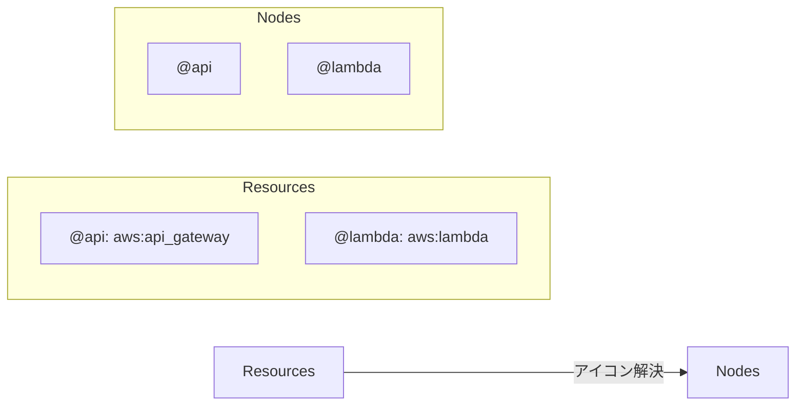

# リソース仕様

このドキュメントでは、gospelo ダイアグラムの Resources 機能について説明します。

## 概要

Resources は、ノード ID で参照できる再利用可能なアイコンとメタデータ定義を作成するメカニズムを提供します。これにより、ダイアグラム定義の一貫性が促進され、重複が削減されます。

## コンセプト



## リソース定義

### 構造

```typescript
interface Resource {
  icon: string;   // アイコン識別子（必須）
  desc?: string;  // 説明（オプション）
}

interface ResourceMap {
  [nodeId: string]: Resource;
}
```

### 例

```json
{
  "resources": {
    "@api": {
      "icon": "aws:api_gateway",
      "desc": "REST API エンドポイント"
    },
    "@lambda": {
      "icon": "aws:lambda",
      "desc": "ビジネスロジックハンドラー"
    },
    "@db": {
      "icon": "aws:dynamodb",
      "desc": "データストレージ"
    }
  }
}
```

## ID 規則

リソース ID は明確にするために `@` プレフィックスで始めるべきです：

```json
{
  "resources": {
    "@api": { "icon": "aws:api_gateway" },
    "@db": { "icon": "aws:dynamodb" }
  },
  "nodes": [
    { "id": "@api", "label": "API Gateway" },
    { "id": "@db", "label": "Database" }
  ]
}
```

**`@` プレフィックスの利点：**
- リソースバックのノードを明確に区別
- 他の識別子との ID 衝突を防止
- 大規模なダイアグラムでの可読性向上

## アイコン解決の優先順位

ノードをレンダリングする際、アイコンは以下の順序で解決されます：

```mermaid
flowchart TD
    A[Node] --> B{明示的なアイコンがある?}
    B -->|Yes| C[node.icon を使用]
    B -->|No| D{ID が resources にある?}
    D -->|Yes| E[resources[id].icon を使用]
    D -->|No| F[アイコンなし]
```

### 優先順位

1. **ノードの明示的な `icon` プロパティ**（最優先）
2. **リソースの `icon` プロパティ**（ノード ID がリソースキーと一致する場合）
3. **undefined**（アイコンなし）

### オーバーライド例

```json
{
  "resources": {
    "@api": { "icon": "aws:api_gateway" }
  },
  "nodes": [
    { "id": "@api", "icon": "aws:lambda" }
  ]
}
```

**結果：** ノードは `aws:api_gateway`（リソース）ではなく `aws:lambda`（明示的）を使用します。

## バリデーションルール

### ルール 1: 一意なリソース使用

各リソース ID は最大で 1 つのノードで使用できます：

```json
{
  "resources": {
    "@api": { "icon": "aws:api_gateway" }
  },
  "nodes": [
    { "id": "@api", "label": "Gateway 1" },
    { "id": "@api", "label": "Gateway 2" }
  ]
}
```

**エラー：** `Resource "@api" is used by multiple nodes. Each resource ID must be unique.`

### ルール 2: アイコン必須

一致するリソースがないノードは明示的な `icon` プロパティを持つ必要があります：

```json
{
  "resources": {
    "@api": { "icon": "aws:api_gateway" }
  },
  "nodes": [
    { "id": "@api" },
    { "id": "@other", "icon": "aws:s3" }
  ]
}
```

`@api` はリソースからアイコンを取得し、`@other` は明示的なアイコンが必要です。

## 実装

### レイアウト解決

```typescript
// src/layout/layout.ts
function computeNodeLayout(node: Node, index: number, parent: ComputedNode | null, resources: ResourceMap): ComputedNode {
  // 指定されていない場合はリソースからアイコンを解決
  let resolvedIcon = node.icon;
  if (!resolvedIcon && resources[node.id]) {
    resolvedIcon = resources[node.id].icon;
  }

  const computed: ComputedNode = {
    ...node,
    icon: resolvedIcon,
    // ...
  };
  // ...
}
```

### パーサーサポート

```typescript
// src/core/parser.ts
function parseLegacyDiagram(raw: RawDiagramInput): DiagramDefinition {
  const diagram: DiagramDefinition = {
    title: raw.title,
    // ...
    resources: (raw as any).resources,
    // ...
  };
  return diagram;
}
```

## ユースケース

### 1. 一元化されたアイコン管理

アイコンを一度定義し、どこでも使用：

```json
{
  "resources": {
    "@api": { "icon": "aws:api_gateway", "desc": "API エンドポイント" },
    "@lambda": { "icon": "aws:lambda", "desc": "コンピューティング" },
    "@db": { "icon": "aws:dynamodb", "desc": "ストレージ" }
  },
  "nodes": [
    { "id": "@api", "label": "REST API", "position": [100, 100] },
    { "id": "@lambda", "label": "Handler", "position": [300, 100] },
    { "id": "@db", "label": "Users Table", "position": [500, 100] }
  ]
}
```

### 2. ドキュメント統合

ドキュメント用に `desc` を使用：

```json
{
  "resources": {
    "@auth": {
      "icon": "aws:cognito",
      "desc": "ユーザー認証と認可を処理。企業 LDAP と統合。"
    }
  }
}
```

### 3. テンプレートパターン

再利用可能なパターンを作成：

```json
{
  "resources": {
    "@frontend": { "icon": "aws:cloudfront", "desc": "CDN" },
    "@api": { "icon": "aws:api_gateway", "desc": "REST API" },
    "@compute": { "icon": "aws:lambda", "desc": "サーバーレスコンピューティング" },
    "@storage": { "icon": "aws:s3", "desc": "オブジェクトストレージ" },
    "@database": { "icon": "aws:dynamodb", "desc": "NoSQL データベース" }
  }
}
```

## 完全な例

```json
{
  "asset": { "version": "1.0" },
  "documents": [
    {
      "type": "diagram",
      "title": "サーバーレスアーキテクチャ",
      "resources": {
        "@cdn": { "icon": "aws:cloudfront", "desc": "コンテンツ配信" },
        "@api": { "icon": "aws:api_gateway", "desc": "REST API エンドポイント" },
        "@auth": { "icon": "aws:cognito", "desc": "ユーザー認証" },
        "@lambda": { "icon": "aws:lambda", "desc": "ビジネスロジック" },
        "@db": { "icon": "aws:dynamodb", "desc": "データストレージ" }
      },
      "nodes": [
        { "id": "@cdn", "label": "CloudFront", "position": [100, 200] },
        { "id": "@api", "label": "API Gateway", "position": [250, 200] },
        { "id": "@auth", "label": "Cognito", "position": [250, 350] },
        { "id": "@lambda", "label": "Lambda", "position": [400, 200] },
        { "id": "@db", "label": "DynamoDB", "position": [550, 200] }
      ],
      "connections": [
        { "from": "@cdn", "to": "@api" },
        { "from": "@api", "to": "@auth", "type": "auth" },
        { "from": "@api", "to": "@lambda" },
        { "from": "@lambda", "to": "@db", "type": "data" }
      ]
    }
  ]
}
```

## 移行ガイド

### 明示的アイコンからの移行

**変更前：**
```json
{
  "nodes": [
    { "id": "api", "icon": "aws:api_gateway", "label": "API" },
    { "id": "lambda", "icon": "aws:lambda", "label": "Lambda" }
  ]
}
```

**変更後：**
```json
{
  "resources": {
    "@api": { "icon": "aws:api_gateway" },
    "@lambda": { "icon": "aws:lambda" }
  },
  "nodes": [
    { "id": "@api", "label": "API" },
    { "id": "@lambda", "label": "Lambda" }
  ]
}
```

**利点：**
- アイコン管理の一元化
- よりクリーンなノード定義
- 一括アイコン更新が容易
- `desc` プロパティによるドキュメント化
